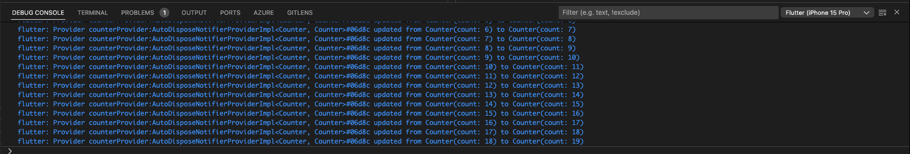
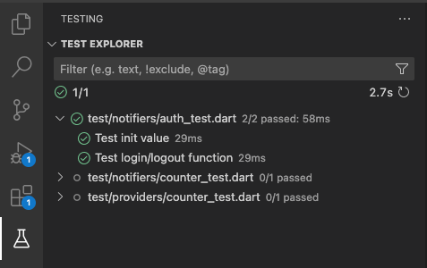

# flutter_study

A new Flutter project.

## Getting Started

This project is a starting point for a Flutter application.

A few resources to get you started if this is your first Flutter project:

- [Lab: Write your first Flutter app](https://docs.flutter.dev/get-started/codelab)
- [Cookbook: Useful Flutter samples](https://docs.flutter.dev/cookbook)

For help getting started with Flutter development, view the
[online documentation](https://docs.flutter.dev/), which offers tutorials,
samples, guidance on mobile development, and a full API reference.

## Setup

1. Install [rps](#pubspec-scripts)
1. To run code generator run: `rps gen`

## Pubspec scripts

> In order to run pubspec scripts first install [Run Pubspec Script](https://pub.dev/packages/rps) by running `dart pub global activate rps`

- Run flutter analyzer
  
  ```shell
  rps lint
  ```

- Run build_runner in watch mode (auto generate scripts for freezed, riverpod etc.)
  
  ```shell
  rps gen
  ```

## Riverpod

To debug Riverpod [Riverpod observer](./lib/utils/riverpod_observer.dart) is used.
See debug console for more info:



## Testing

To execute Flutter tests run: `flutter test` or use VS Code Testing function.



## Mason setup

Get bricks:

```bash
mason get
```

Generate simple package from a brick:

```bash
mason make simple_package -o packages
```

## Mason usage

```bash
mason init
```

```bash
mason new test_brick --desc "My awesome, new brick" 
```

in mason.yaml add

```yaml
  test_brick:
    path: bricks/test_brick
```

```bash
mason list
```

```bash
mason make test_brick
```

in mason.yaml
  test_brick:
    path: bricks/test_brick

### Built-in Lambdas

[To format variables use Lambdas](https://pub.dev/packages/mason_cli#built-in-lambdas)

### Global bricks

#### Add

```bash
mason add -g --source git https://github.com/felangel/mason --path bricks/widget
```

#### Remove

```bash
mason remove widget
```

#### Get all bricks (generate mason-lock.json)

```bash
mason get
```
